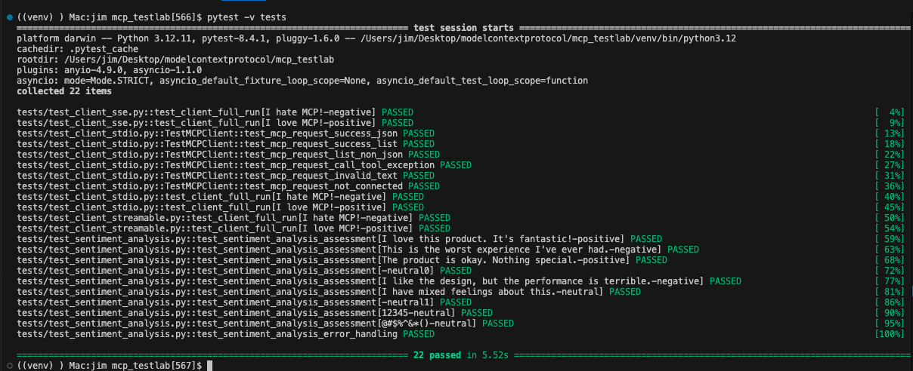

# Model Context Protocol (MCP) Test Lab

This project demonstrates the use of Model Context Protocol (MCP) and how it works with `langgraph` to build an agent.  There are two parts to this project.   

The first demonstrates the use of MCP for sentiment analysis and is based on the [Hugging Face MCP Course](https://huggingface.co/learn/mcp-course/unit2/introduction). Instead of using the `gradio` library in the HuggingFace course, this project utilizes the `fastmcp` library to implement an MCP server and client.

The second part implements an MCP agent that connects to various tools, including mathematical operations and sentiment analysis capabilities, allowing for a more complex AI assistant.  This part makes use of the `langgraph` library to create an agent that can interact with these tools.


## Overview

This project demonstrates different implementations of the Model Context Protocol (MCP) with a focus on sentiment analysis and agent capabilities:

- **mcp-sentiment/**: Contains the MCP server implementation (app_fastmcp.py) and various client implementations using different transport protocols (stdio, SSE, and streamable-http) for sentiment analysis.  See [mcp-sentiment/README.md](mcp-sentiment/README.md) for more details.

- **mcp-agent/**: Implements agent functionality with specialized tools for mathematical operations and sentiment analysis, along with a client to interact with these agent capabilities.  See [mcp-agent/README.md](mcp-agent/README.md) for more details.

- **tests/**: Comprehensive test suite validating all components of the system, including client implementations across different transport protocols, agent functionality, math tools, and sentiment analysis capabilities.

## Codebase Directory Structure

```plaintext
mcp_testlab/
├── mcp-sentiment/
│   ├── app_fastmcp.py
│   ├── mcp_client_stdio.py
│   ├── mcp_client_sse.py
│   └── mcp_client_streamable.py
├── mcp-agent/
│   ├── agent_client.py
│   ├── math_tools.py
│   └── sentiment_tools.py
├── tests/
│   ├── test_agent_client.py
│   ├── test_client_stdio.py
│   ├── test_client_sse.py
│   ├── test_client_streamable.py
│   ├── test_math_tools.py
│   └── test_sentiment_analysis.py
├── requirements.txt
├── README.md
├── LICENSE
├── .gitignore
└── .gitattributes
```

## Unit Tests
Unit tests are provided to ensure the functionality of the MCP server and client. To run the tests, use the following command:
```bash
$ pytest -v tests
```

Sample output:



