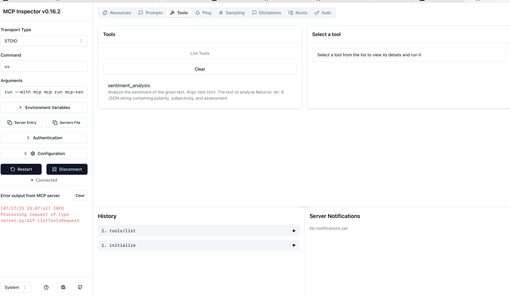
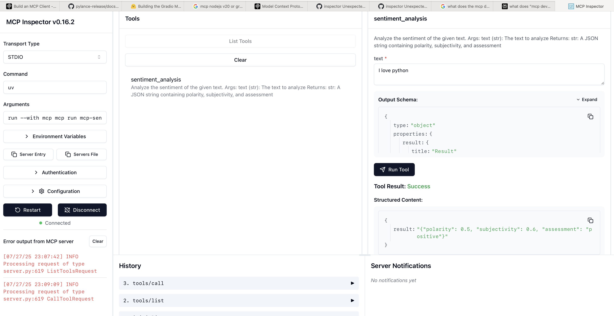

# MCP Testbed

This project demonstrates sentiment analysis using the Model Context Protocol (MCP) and is based on the [Hugging Face MCP Course](https://huggingface.co/learn/mcp-course/unit2/introduction).  Instead of using the `gradio` library, it utilizes the `fastmcp` library to implement an MCP server and client.

## Folder Structure

- `mcp-sentiment/app_fastmcp.py`: MCP server script for sentiment analysis.
- `mcp-sentiment/mcp_client_stdio.py`: MCP client that connects to the server and requests sentiment analysis via command line.

## Usage

To run sentiment analysis from the command line:

```bash
python mcp-sentiment/mcp_client_stdio.py "Your text to test sentiment"
```

If no text is provided, the program will exit with an error message.

## How It Works

The application uses Model Context Protocol (MCP) to facilitate communication between a client and a sentiment analysis server. When you run the client with a text string, it:

1. Connects to the server script (`app_fastmcp.py`)
2. Sends your text for sentiment analysis
3. Returns the sentiment result (positive, negative, or neutral)

### Server (app_fastmcp.py)

The `app_fastmcp.py` file implements an MCP server using FastMCP that:
- Exposes a sentiment analysis tool via the Model Context Protocol
- Uses TextBlob library to analyze sentiment of provided text
- Returns JSON results with:
  - Polarity score (-1 to 1, negative to positive)
  - Subjectivity score (0 to 1, objective to subjective)
  - Overall assessment (positive, negative, or neutral)
- Supports stdio transport for communication with clients

### Client (mcp_client_stdio.py)

The `mcp_client_stdio.py` file implements an MCP client that:
- Accepts text input from the command line
- Establishes a connection to the MCP server using stdio transport
- Lists available tools on the connected server
- Sends the input text to the sentiment_analysis tool
- Receives and displays the JSON response with sentiment results
- Properly manages resources with async context managers

## MCP Inspector

The MCP Inspector is a tool for exploring and interacting with Model Context Protocol (MCP) servers. It provides a user-friendly interface for:

- Discovering available tools and their capabilities
- Sending requests to tools and viewing responses
- Debugging and testing MCP interactions

To run the MCP Inspector, use the following command:

```bash
mcp dev mcp-sentiment/app_fastmcp.py
```

Sample output will show the available tools and their descriptions, allowing you to interact with the sentiment analysis tool.

### MCP Inspector Listing Tools


### MCP Inspector Testing Sentiment Analysis Tool



## Requirements

- Python 3.12+
- Dependencies: `pip install -r requirements.txt`
- Required NLP libraries for sentiment analysis
- Required version of `node` > v20.x to run MCP Inspector (see [GH Issue on unexpected token](https://github.com/modelcontextprotocol/python-sdk/issues/184#issuecomment-2788071291))


