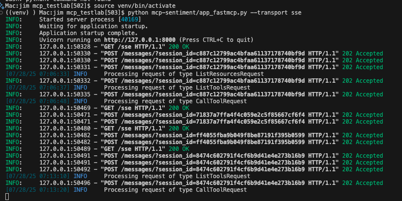
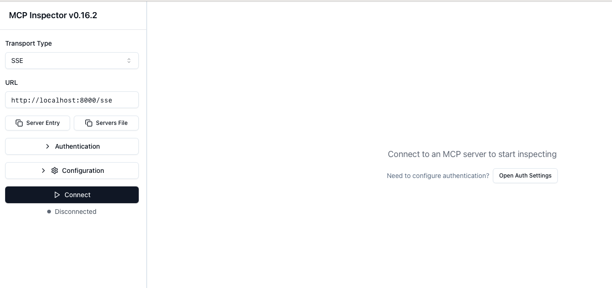
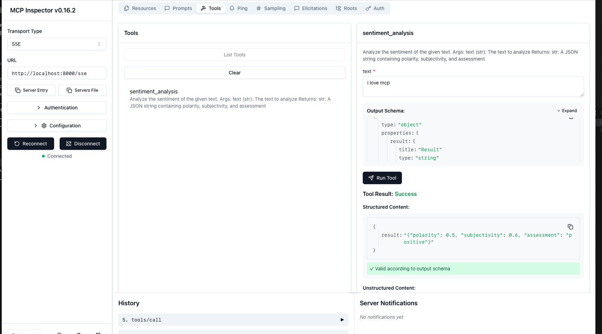
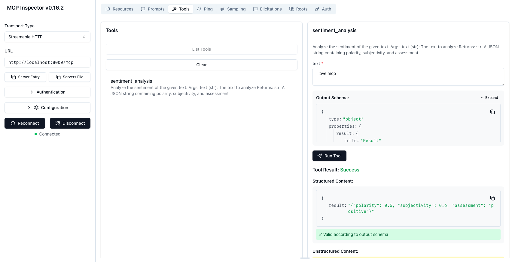

# MCP Testbed

This project demonstrates sentiment analysis using the Model Context Protocol (MCP) and is based on the [Hugging Face MCP Course](https://huggingface.co/learn/mcp-course/unit2/introduction). Instead of using the `gradio` library in the HuggingFace course, this project utilizes the `fastmcp` library to implement an MCP server and client.


## Folder Structure

- `mcp-sentiment/app_fastmcp.py`: MCP server script for sentiment analysis.
- `mcp-sentiment/mcp_client_stdio.py`: MCP client that connects to the server and requests sentiment analysis via command line.
- `mcp-sentiment/mcp_client_sse.py`: MCP client that connects to the server and requests sentiment analysis via SSE transport.
- `mcp-sentiment/mcp_client_streamable.py`: MCP client that connects to the server and requests sentiment analysis via streamable-http transport.


## How It Works

The application uses Model Context Protocol (MCP) to facilitate communication between a client and a sentiment analysis server. When you run the client with a text string, it:

1. Connects to the server script (`app_fastmcp.py`) or `sse`/`streamable-http` endpoint
2. Sends your text for sentiment analysis
3. Returns the sentiment result (positive, negative, or neutral)

### Server (app_fastmcp.py)

The `app_fastmcp.py` file implements an MCP server using FastMCP that:
- Exposes a sentiment analysis tool via the Model Context Protocol
- Uses TextBlob library to analyze sentiment of provided text
- Returns JSON results with:
  - Polarity score (-1 to 1, negative to positive)
  - Subjectivity score (0 to 1, objective to subjective)
  - Overall assessment (positive, negative, or neutral)
- Supports `stdio` or `sse` or `streamable-http` transport for communication with clients

### Client (mcp_client_stdio.py)

The `mcp_client_stdio.py` file implements an MCP client that:
- Uses the argparse library for command-line argument handling
- Accepts text input as a required positional argument
- Accepts an optional `--server` parameter to specify the server script path
- Accepts an optional `--verbose` flag to display detailed tool information
- Establishes a connection to the MCP server using stdio transport
- Lists available tools on the connected server
- Sends the input text to the sentiment_analysis tool
- Displays formatted sentiment results showing polarity, subjectivity, and assessment
- Properly manages resources with async context managers and AsyncExitStack

### Client (mcp_client_sse.py)

The `mcp_client_sse.py` file implements an MCP client that:
- Uses the argparse library for command-line argument handling
- Accepts text input as a required positional argument
- Accepts an optional `--url` parameter to specify the server endpoint (default: http://localhost:8000/sse)
- Accepts an optional `--verbose` flag to display detailed tool information
- Establishes a connection to the MCP server using SSE transport
- Lists available tools on the connected server
- Sends the input text to the sentiment_analysis tool
- Displays formatted sentiment results showing polarity, subjectivity, and assessment
- Properly manages resources with async context managers and AsyncExitStack

### Client (mcp_client_streamable.py)

The `mcp_client_streamable.py` file implements an MCP client that:
- Uses the argparse library for command-line argument handling
- Accepts text input as a required positional argument
- Accepts an optional `--url` parameter to specify the server endpoint (default: http://localhost:8000/mcp)
- Accepts an optional `--verbose` flag to display detailed tool information
- Establishes a connection to the MCP server using streamable-http transport
- Displays the session ID when available
- Lists available tools on the connected server
- Sends the input text to the sentiment_analysis tool
- Displays formatted sentiment results showing polarity, subjectivity, and assessment
- Properly manages resources with async context managers and AsyncExitStack

### Example Usage with `stdio` Transport

**Command-line Arguments**
```bash
((venv) ) Mac:jim mcp_testlab[529]$ python mcp-sentiment/mcp_client_stdio.py --help
usage: mcp_client_stdio.py [-h] [--server SERVER] [--verbose] text

MCP Client for sentiment analysis using stdio transport

positional arguments:
  text             Text to analyze for sentiment

options:
  -h, --help       show this help message and exit
  --server SERVER  Path to the MCP server script (default: mcp-sentiment/app_fastmcp.py)
  --verbose, -v    Display detailed information about available tools


**Client**
```bash
((venv) ) Mac:jim mcp_testlab[530]$ python mcp-sentiment/mcp_client_stdio.py "I love mcp"

Connected to MCP server at mcp-sentiment/app_fastmcp.py
Listing available tools...
[07/29/25 08:38:26] INFO     Processing request of type ListToolsRequest                                                                                                                                        server.py:619

Connected to MCP server. Listing available tools...
                    INFO     Processing request of type ListToolsRequest                                                                                                                                        server.py:619

Available tools: ['sentiment_analysis']

Analyzing sentiment for: 'I love mcp'
                    INFO     Processing request of type CallToolRequest                                                                                                                                         server.py:619

Sentiment Analysis Result:
  Polarity: N/A (-1=negative, 1=positive)
  Subjectivity: N/A (0=objective, 1=subjective)
  Assessment: N/A


((venv) ) Mac:jim mcp_testlab[531]$ python mcp-sentiment/mcp_client_stdio.py "I love mcp" -v

Connected to MCP server at mcp-sentiment/app_fastmcp.py
Listing available tools...
[07/29/25 08:38:57] INFO     Processing request of type ListToolsRequest                                                                                                                                        server.py:619

Connected to MCP server. Listing available tools...
                    INFO     Processing request of type ListToolsRequest                                                                                                                                        server.py:619

sentiment_analysis:
  Description: 
    Analyze the sentiment of the given text.

    Args:
        text (str): The text to analyze

    Returns:
        str: A JSON string containing polarity, subjectivity, and assessment
    
  Annotations: None
  Inputschema: {'properties': {'text': {'title': 'Text', 'type': 'string'}}, 'required': ['text'], 'title': 'sentiment_analysisArguments', 'type': 'object'}
  Meta: None
/Users/jim/Desktop/modelcontextprotocol/mcp_testlab/mcp-sentiment/mcp_client_stdio.py:153: PydanticDeprecatedSince211: Accessing the 'model_computed_fields' attribute on the instance is deprecated. Instead, you should access this attribute from the model class. Deprecated in Pydantic V2.11 to be removed in V3.0.
  value = getattr(tool, attr)
  Model_computed_fields: {}
  Model_config: {'extra': 'allow'}
  Model_extra: {}
/Users/jim/Desktop/modelcontextprotocol/mcp_testlab/mcp-sentiment/mcp_client_stdio.py:153: PydanticDeprecatedSince211: Accessing the 'model_fields' attribute on the instance is deprecated. Instead, you should access this attribute from the model class. Deprecated in Pydantic V2.11 to be removed in V3.0.
  value = getattr(tool, attr)
  Model_fields: {'name': FieldInfo(annotation=str, required=True), 'title': FieldInfo(annotation=Union[str, NoneType], required=False, default=None), 'description': FieldInfo(annotation=Union[str, NoneType], required=False, default=None), 'inputSchema': FieldInfo(annotation=dict[str, Any], required=True), 'outputSchema': FieldInfo(annotation=Union[dict[str, Any], NoneType], required=False, default=None), 'annotations': FieldInfo(annotation=Union[ToolAnnotations, NoneType], required=False, default=None), 'meta': FieldInfo(annotation=Union[dict[str, Any], NoneType], required=False, default=None, alias='_meta', alias_priority=2)}
  Model_fields_set: {'description', 'name', 'inputSchema', 'outputSchema'}
  Outputschema: {'properties': {'result': {'title': 'Result', 'type': 'string'}}, 'required': ['result'], 'title': 'sentiment_analysisOutput', 'type': 'object'}
  Title: None

Analyzing sentiment for: 'I love mcp'
                    INFO     Processing request of type CallToolRequest                                                                                                                                         server.py:619

Sentiment Analysis Result:
  Polarity: N/A (-1=negative, 1=positive)
  Subjectivity: N/A (0=objective, 1=subjective)
  Assessment: N/A
```

### Example Usage with `sse` Transport

**Command-line Arguments**
```bash
((venv) ) Mac:jim mcp_testlab[532]$ python mcp-sentiment/mcp_client_sse.py --help
usage: mcp_client_sse.py [-h] [--url URL] [--verbose] text_to_test

MCP SSE Client for Sentiment Analysis

positional arguments:
  text_to_test   Text to analyze for sentiment

options:
  -h, --help     show this help message and exit
  --url URL      URL of the SSE server endpoint (default: http://localhost:8000/sse)
  --verbose, -v  Display detailed information about available tools
```

**Client**
```bash
((venv) ) Mac:jim mcp_testlab[510]$ python mcp-sentiment/mcp_client_sse.py "MCP is great"

Connected to MCP server. Listing available tools...

tools: ['sentiment_analysis']

Sentiment Analysis Result: [TextContent(type='text', text='{"polarity": 0.8, "subjectivity": 0.75, "assessment": "positive"}', annotations=None, meta=None)]
((venv) ) Mac:jim mcp_testlab[510]$ python mcp-sentiment/mcp_client_sse.py "Java is not as good as Python"

Connected to MCP server. Listing available tools...

tools: ['sentiment_analysis']

Sentiment Analysis Result: [TextContent(type='text', text='{"polarity": 0.7, "subjectivity": 0.6, "assessment": "positive"}', annotations=None, meta=None)]
((venv) ) Mac:jim mcp_testlab[511]$ python mcp-sentiment/mcp_client_sse.py "Java is hard to use"

Connected to MCP server. Listing available tools...

tools: ['sentiment_analysis']

Sentiment Analysis Result: [TextContent(type='text', text='{"polarity": -0.29, "subjectivity": 0.54, "assessment": "negative"}', annotations=None, meta=None)]``` 
```

**SSE Server**
```bash
((venv) ) Mac:jim mcp_testlab[506]$ python mcp-sentiment/app_fastmcp.py --transport sse
INFO:     Started server process [8908]
INFO:     Waiting for application startup.
INFO:     Application startup complete.
INFO:     Uvicorn running on http://127.0.0.1:8000 (Press CTRL+C to quit)
INFO:     127.0.0.1:49538 - "GET /sse HTTP/1.1" 200 OK
INFO:     127.0.0.1:49540 - "POST /messages/?session_id=fb1a89915f0b40e98f44385af5b6db58 HTTP/1.1" 202 Accepted
INFO:     127.0.0.1:49540 - "POST /messages/?session_id=fb1a89915f0b40e98f44385af5b6db58 HTTP/1.1" 202 Accepted
INFO:     127.0.0.1:49540 - "POST /messages/?session_id=fb1a89915f0b40e98f44385af5b6db58 HTTP/1.1" 202 Accepted
[07/29/25 06:13:08] INFO     Processing request of type ListToolsRequest                                                                                                                           server.py:619
INFO:     127.0.0.1:49540 - "POST /messages/?session_id=fb1a89915f0b40e98f44385af5b6db58 HTTP/1.1" 202 Accepted
                    INFO     Processing request of type CallToolRequest                                                                                                                            server.py:619
INFO:     127.0.0.1:49543 - "GET /sse HTTP/1.1" 200 OK
INFO:     127.0.0.1:49545 - "POST /messages/?session_id=632a380ef69344eab4bf145158e05051 HTTP/1.1" 202 Accepted
INFO:     127.0.0.1:49545 - "POST /messages/?session_id=632a380ef69344eab4bf145158e05051 HTTP/1.1" 202 Accepted
INFO:     127.0.0.1:49545 - "POST /messages/?session_id=632a380ef69344eab4bf145158e05051 HTTP/1.1" 202 Accepted
[07/29/25 06:13:46] INFO     Processing request of type ListToolsRequest                                                                                                                           server.py:619
INFO:     127.0.0.1:49545 - "POST /messages/?session_id=632a380ef69344eab4bf145158e05051 HTTP/1.1" 202 Accepted
                    INFO     Processing request of type CallToolRequest                                                                                                                            server.py:619
INFO:     127.0.0.1:49547 - "GET /sse HTTP/1.1" 200 OK
INFO:     127.0.0.1:49549 - "POST /messages/?session_id=f6a51e126c12412398bacc85753174a3 HTTP/1.1" 202 Accepted
INFO:     127.0.0.1:49549 - "POST /messages/?session_id=f6a51e126c12412398bacc85753174a3 HTTP/1.1" 202 Accepted
INFO:     127.0.0.1:49549 - "POST /messages/?session_id=f6a51e126c12412398bacc85753174a3 HTTP/1.1" 202 Accepted
[07/29/25 06:14:17] INFO     Processing request of type ListToolsRequest                                                                                                                           server.py:619
INFO:     127.0.0.1:49549 - "POST /messages/?session_id=f6a51e126c12412398bacc85753174a3 HTTP/1.1" 202 Accepted
                    INFO     Processing request of type CallToolRequest                                                                                                                            server.py:619
INFO:     Shutting down
INFO:     Waiting for application shutdown.
INFO:     Application shutdown complete.
INFO:     Finished server process [8908]
Terminated: 15             python mcp-sentiment/app_fastmcp.py --transport sse
```

### Example Usage with `streamable-http` Transport

**Command-line Arguments**
```bash
((venv) ) Mac:jim mcp_testlab[533]$ python mcp-sentiment/mcp_client_streamable.py --help
usage: mcp_client_streamable.py [-h] [--url URL] [--verbose] text_to_test

MCP Streamable Client for Sentiment Analysis

positional arguments:
  text_to_test   Text to analyze for sentiment

options:
  -h, --help     show this help message and exit
  --url URL      URL of the streamable-http server endpoint (default: http://localhost:8000/mcp)
  --verbose, -v  Display detailed information about available tools
```

**Client**
```bash
# Using the default URL
((venv) ) Mac:jim mcp_testlab[506]$ python mcp-sentiment/mcp_client_streamable.py "I love MCP"
Session ID: 6a17c2206e6e478b830bd0da73771b8b

Connected to MCP server. Listing available tools...

# Using a custom URL
((venv) ) Mac:jim mcp_testlab[507]$ python mcp-sentiment/mcp_client_streamable.py "I love MCP" --url "http://localhost:8000/mcp"
Session ID: 8f3b5a9c2d1e7f6b4a8c9d0e7f6a5b4

Connected to MCP server. Listing available tools...

tools: ['sentiment_analysis']

Sentiment Analysis Result: [TextContent(type='text', text='{"polarity": 0.5, "subjectivity": 0.6, "assessment": "positive"}', annotations=None, meta=None)]
``` 

**Streamable-HTTP Server**
```bash
((venv) ) Mac:jim mcp_testlab[507]$ python mcp-sentiment/app_fastmcp.py --transport streamable-http
INFO:     Started server process [2701]
INFO:     Waiting for application startup.
[07/28/25 22:48:20] INFO     StreamableHTTP session manager started                                                                                                               streamable_http_manager.py:112
INFO:     Application startup complete.
INFO:     Uvicorn running on http://127.0.0.1:8000 (Press CTRL+C to quit)
INFO:     127.0.0.1:54049 - "POST /mcp HTTP/1.1" 307 Temporary Redirect
[07/28/25 22:48:29] INFO     Created new transport with session ID: 6a17c2206e6e478b830bd0da73771b8b                                                                              streamable_http_manager.py:229
INFO:     127.0.0.1:54049 - "POST /mcp/ HTTP/1.1" 200 OK
INFO:     127.0.0.1:54052 - "POST /mcp HTTP/1.1" 307 Temporary Redirect
INFO:     127.0.0.1:54053 - "GET /mcp HTTP/1.1" 307 Temporary Redirect
INFO:     127.0.0.1:54052 - "POST /mcp/ HTTP/1.1" 202 Accepted
INFO:     127.0.0.1:54053 - "GET /mcp/ HTTP/1.1" 200 OK
INFO:     127.0.0.1:54055 - "POST /mcp HTTP/1.1" 307 Temporary Redirect
INFO:     127.0.0.1:54055 - "POST /mcp/ HTTP/1.1" 200 OK
                    INFO     Processing request of type ListToolsRequest                                                                                                                           server.py:619
INFO:     127.0.0.1:54057 - "POST /mcp HTTP/1.1" 307 Temporary Redirect
INFO:     127.0.0.1:54057 - "POST /mcp/ HTTP/1.1" 200 OK
                    INFO     Processing request of type CallToolRequest                                                                                                                            server.py:619
INFO:     127.0.0.1:54059 - "DELETE /mcp HTTP/1.1" 307 Temporary Redirect
                    INFO     Terminating session: 6a17c2206e6e478b830bd0da73771b8b                                                                                                        streamable_http.py:633
INFO:     127.0.0.1:54059 - "DELETE /mcp/ HTTP/1.1" 200 OK
INFO:     Shutting down
INFO:     Waiting for application shutdown.
[07/28/25 22:48:42] INFO     StreamableHTTP session manager shutting down                                                                                                         streamable_http_manager.py:116
INFO:     Application shutdown complete.
INFO:     Finished server process [2701]
Terminated: 15             python mcp-sentiment/app_fastmcp.py --transport streamable-http
```

## MCP Inspector

The MCP Inspector is a tool for exploring and interacting with Model Context Protocol (MCP) servers. It provides a user-friendly interface for:

- Discovering available tools and their capabilities
- Sending requests to tools and viewing responses
- Debugging and testing MCP interactions

### Running MCP Inspector with `stdio` Transport
To run the MCP Inspector for server using `stdio` transport, use the following command:

```bash
mcp dev mcp-sentiment/app_fastmcp.py
```

Sample output will show the available tools and their descriptions, allowing you to interact with the sentiment analysis tool.

### MCP Inspector Listing Tools


### MCP Inspector Testing Sentiment Analysis


### Running MCP Inspector with `sse` Transport


### Starting the `sse` Server for testing
```bash
python mcp-sentiment/app_fastmcp.py --transport sse
```



To run the MCP Inspector for server using `sse` or `streamable-http` transport, use the following command:

```bash
npx @modelcontextprotocol/inspector
```

### Connecting to the MCP Inspector
Open the browser to access the MCP Inspector interface, change from `http` to `https` if necessary.  Once the MCP Inspector is running, configure "Transport Type" for `sse` or `streamable-http` and set the server URL to point to your running MCP server (e.g., `http://localhost:8000/sse` or `http://localhost:8000/mcp`) and click "Connect" button.

**`sse` Server URL**: `http://localhost:8000/sse`





### Starting the `streamable-http` Server for testing
```bash
python mcp-sentiment/app_fastmcp.py --transport streamable-http
```

**`streamable-http` Server URL**: `http://localhost:8000/mcp`



## Requirements

- Python 3.12+
- Dependencies: `pip install -r requirements.txt`
- Required NLP libraries for sentiment analysis
- Required version of `node` > v20.x to run MCP Inspector (see [GH Issue on unexpected token](https://github.com/modelcontextprotocol/python-sdk/issues/184#issuecomment-2788071291))


