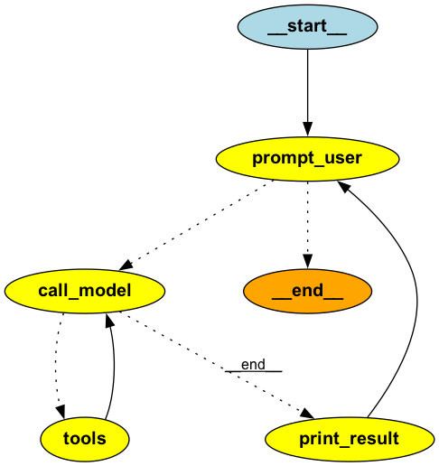

# MCP Agent

This README provides an overview of the MCP Agent, a modular AI assistant that connects to MCP-based math and sentiment analysis tools. It describes the architecture, available modules (`agent_client.py`, `math_tools.py`, `sentiment_tools.py`), example usage scenarios, tool capabilities, and the workflow for handling user queries. The document also includes command-line usage instructions, sample interactions, and diagrams illustrating module relationships and the conversation flow.

## Module Summary

### agent_client.py

agent_client.py is an interactive client application that connects AI models with MCP-based tools. It showcases how to build an AI assistant that can perform mathematical operations and sentiment analysis.

#### Key Features

- **Multi-Server MCP Client**: Connects to multiple MCP servers (math and sentiment tools)
- **LangChain Integration**: Uses LangChain's chat model interface with OpenAI's GPT-4o-mini
- **LangGraph Workflow**: Implements a state machine using StateGraph for conversation flow
- **Interactive Interface**: Provides a command-line interface for user interaction
- **Asynchronous Design**: Leverages Python's asyncio for non-blocking operations

#### Architecture



The client implements a conversation loop with the following components:

1. **User Input Handler**: Asynchronously collects user queries
2. **Model Invocation**: Routes queries to the LLM with bound tools
3. **Tool Execution**: Dispatches tool calls to appropriate MCP servers
4. **Response Formatter**: Presents results back to the user

### math_tools.py

math_tools.py provides a simple MCP server for mathematical operations using the FastMCP framework.

#### Available Tools

- **add**: Adds two integers
  ```python
  add(a: int, b: int) -> int
  ```
- **multiply**: Multiplies two integers
  ```python
  multiply(a: int, b: int) -> int
  ```

#### Implementation Details

- Built using FastMCP with the server name "MathTools"
- Configured for stdio transport by default
- Includes comprehensive docstrings following Google style
- Provides proper type annotations for all parameters and return values

### sentiment_tools.py

sentiment_tools.py exposes natural language sentiment analysis capabilities through the MCP interface.

#### Available Tools

- **analyze_sentiment**: Analyzes text for emotional tone
  ```python
  analyze_sentiment(text: str) -> dict
  ```

#### Return Format

The sentiment analysis tool returns a dictionary with:

- **polarity**: Float between -1.0 (negative) and 1.0 (positive)
- **subjectivity**: Float between 0.0 (objective) and 1.0 (subjective)
- **assessment**: String classification ("positive", "negative", or "neutral")

#### Implementation Details

- Uses TextBlob for sentiment analysis
- Built with FastMCP with the server name "SentimentTools"
- Follows project coding standards with comprehensive documentation
- Configured for stdio transport by default


## Example Usage

The components work together to create an AI assistant that can:

1. Process natural language queries
2. Identify when to use mathematical or sentiment analysis tools
3. Execute appropriate tool calls
4. Format and return results in a user-friendly manner

This implementation demonstrates the Model Context Protocol's ability to seamlessly connect AI models with specialized tools, creating a more capable assistant.


### Starting the MCP Agent

To use the MCP Agent client, 
```bash
python mcp-agent/agent_client.py
((venv) ) Mac:jim mcp_testlab[514]$ python mcp-agent/agent_client.py 
[07/31/25 17:40:35] INFO     Starting MCP server 'MathTools' with transport 'stdio'                   server.py:1371
[07/31/25 17:40:35] INFO     Starting MCP server 'SentimentTools' with transport 'stdio'              server.py:1371

Welcome to the MCP Agent! Ask me questions and I'll use tools to help answer them.
Type an empty message to exit.

Enter your question (or press Enter to exit): 
```

### Available Tools

```bash
Enter your question (or press Enter to exit): what tools are available

Processing: 'what tools are available'

Response: I have access to two sets of tools:

1. Math tools: I can perform addition and multiplication of numbers.
2. Sentiment tools: I can analyze the sentiment of text to determine if it is positive, negative, or neutral.

Let me know if you need help with any mathematical operations or sentiment analysis!
```

### Tool Details
```bash
Enter your question (or press Enter to exit): list details about each tool

Processing: 'list details about each tool'

Response: Here are the details about each tool available:

### Math Tools
1. **Add**
   - **Function**: Adds two integers.
   - **Arguments**: 
     - `a`: The first integer to add.
     - `b`: The second integer to add.
   - **Returns**: The sum of `a` and `b`.

2. **Multiply**
   - **Function**: Multiplies two integers.
   - **Arguments**: 
     - `a`: The first integer to multiply.
     - `b`: The second integer to multiply.
   - **Returns**: The product of `a` and `b`.

### Sentiment Tools
1. **Analyze Sentiment**
   - **Function**: Analyzes the sentiment of provided text.
   - **Arguments**: 
     - `text`: The input text string to analyze for sentiment.
   - **Returns**: A dictionary containing:
     - `polarity`: Float between -1.0 (negative) and 1.0 (positive).
     - `subjectivity`: Float between 0.0 (objective) and 1.0 (subjective).
     - `assessment`: String classification ("positive", "negative", or "neutral").

If you would like to use any of these tools, just let me know how I can assist you!
```

### Using Math Tools

```bash
Enter your question (or press Enter to exit): what is 3 plus 4

Processing: 'what is 3 plus 4'
[07/31/25 17:44:43] INFO     Starting MCP server 'MathTools' with transport 'stdio'                   server.py:1371

Response: 3 plus 4 equals 7.

Enter your question (or press Enter to exit): what is 3 times 4

Processing: 'what is 3 times 4'
[07/31/25 17:44:54] INFO     Starting MCP server 'MathTools' with transport 'stdio'                   server.py:1371

Response: 3 times 4 equals 12.

Enter your question (or press Enter to exit): what is 8 divided by 4

Processing: 'what is 8 divided by 4'

Response: I cannot perform division operations. Please let me know if you need help with addition, multiplication, or sentiment analysis!
```
### Using Sentiment Tools
```bash
Enter your question (or press Enter to exit): I love MCP

Processing: 'I love MCP'
[07/31/25 17:45:52] INFO     Starting MCP server 'SentimentTools' with transport 'stdio'              server.py:1371

Response: The sentiment analysis of the text "I love MCP" is as follows:
- Polarity: 0.5 (positive)
- Subjectivity: 0.6 (subjective)
- Assessment: positive

Enter your question (or press Enter to exit): Learning Python is fun                  

Processing: 'Learning Python is fun'
[07/31/25 17:46:27] INFO     Starting MCP server 'SentimentTools' with transport 'stdio'              server.py:1371

Response: The sentiment analysis of the text "Learning Python is fun" is as follows:
- Polarity: 0.3 (positive)
- Subjectivity: 0.2 (objective)
- Assessment: positive

Enter your question (or press Enter to exit): Learning JAVA is very hard and difficult

Processing: 'Learning JAVA is very hard and difficult'
[07/31/25 17:46:40] INFO     Starting MCP server 'SentimentTools' with transport 'stdio'              server.py:1371

Response: The sentiment analysis of the text "Learning JAVA is very hard and difficult" is as follows:
- Polarity: -0.44 (negative)
- Subjectivity: 0.85 (subjective)
- Assessment: negative
```

### Question not Supported by Tools
```bash
Enter your question (or press Enter to exit): what is the capital of hawaii

Processing: 'what is the capital of hawaii'

Response: I cannot provide information on geographical locations or facts. However, if you have any mathematical operations or need sentiment analysis, feel free to ask!
```

## Module Relationship Diagram

```
            +-------------------+
            |   agent_client.py |
            +-------------------+
                /           \
              MCP           MCP
              /               \
             v                 v
+-------------------+      +----------------------+
|   math_tools.py   |      |  sentiment_tools.py  |
+-------------------+      +----------------------+
```

