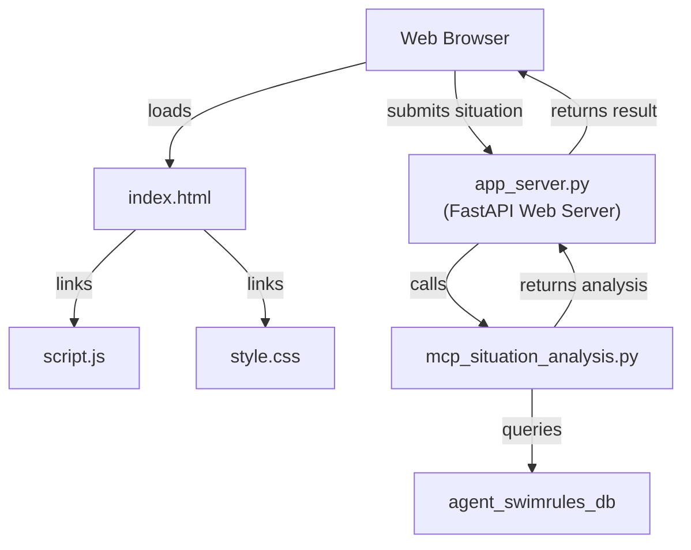
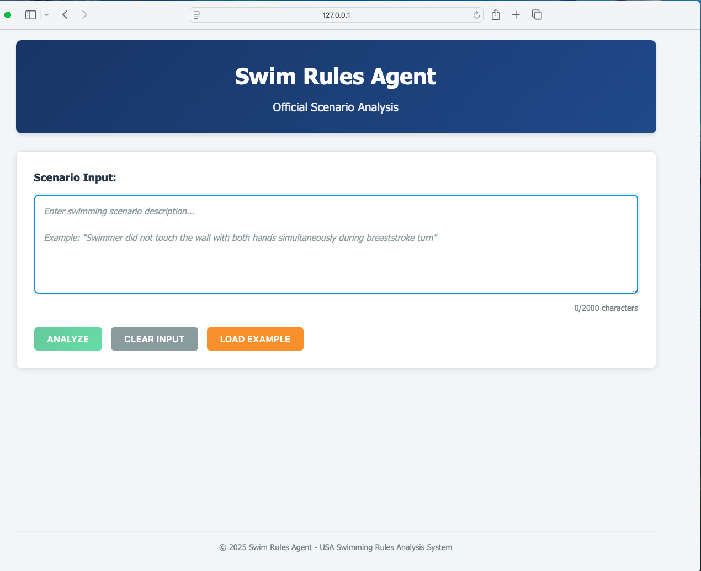
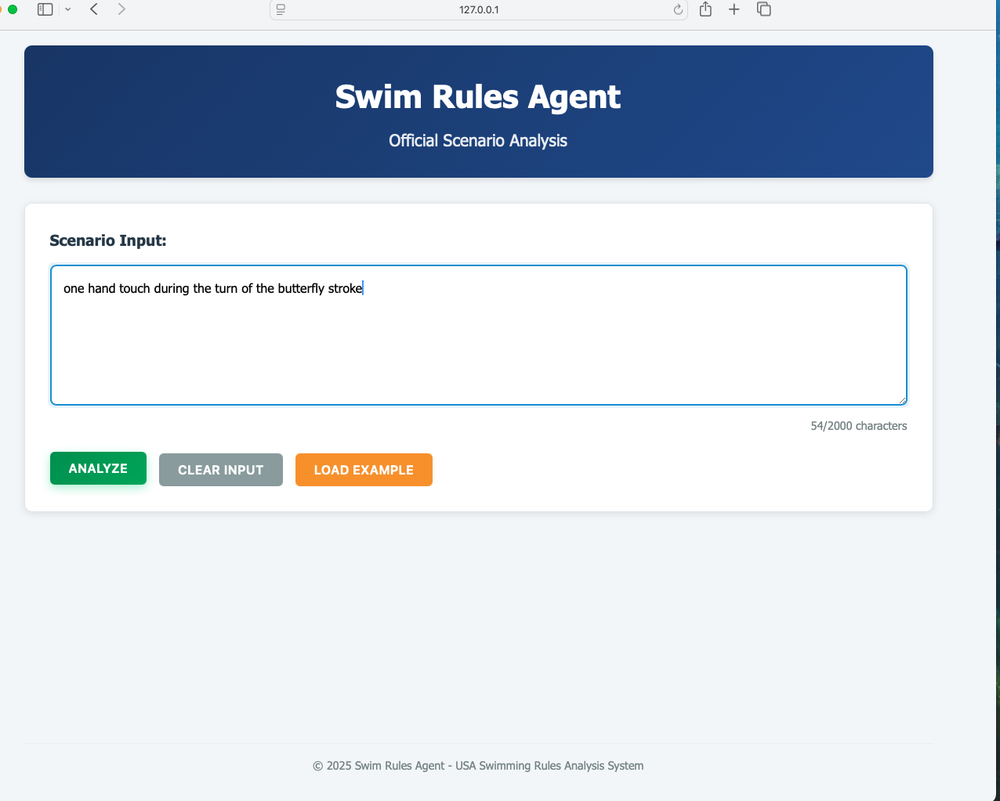
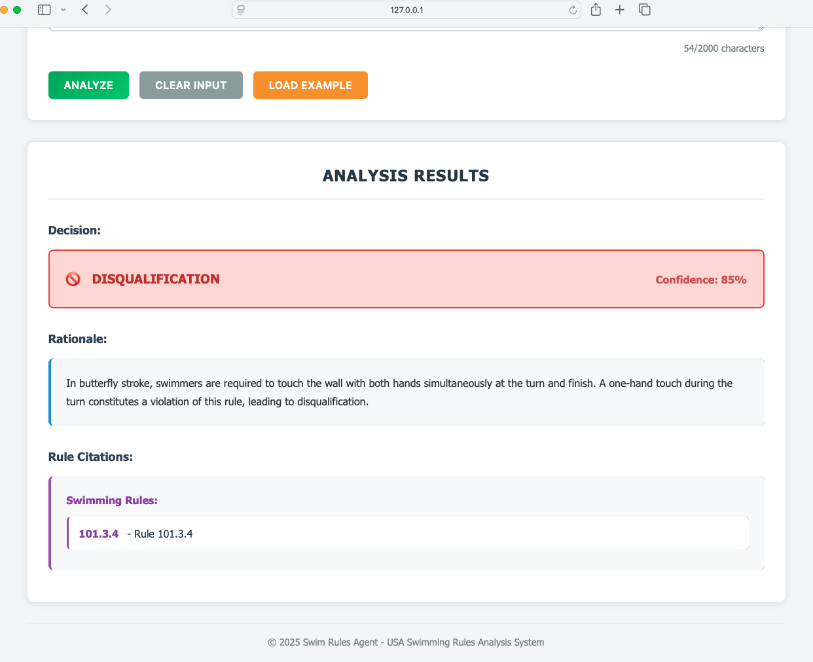

# Swim Rule Analysis

## Directory Structure

```text
mcp-swimrules/
├── app_server.py
├── mcp_situation_analysis.py
├── product_requirements_doc.md
├── README.md
├── images/
│   ├── swim_web1.png
│   ├── swim_web2.png
│   └── swim_web3.png
├── static/
│   ├── style.css
│   ├── script.js
│   └── ... (other static assets and JS files)
├── templates/
│   ├── index.html
│   └── ... (other template files)
├── vsc_agent_logs/
│   └── ... (agent log files)
```

- `app_server.py`: FastAPI web application server.
- `mcp_situation_analysis.py`: MCP server for RAG and LLM-based situation analysis.
- `product_requirements_doc.md`: Product requirements document for the SWIM Rules web application.
- `images/`: Screenshots of the web UI.
- `static/`: Static assets such as CSS and JavaScript files.
- `templates/`: HTML template files for the web UI.
- `vsc_agent_logs/`: Visual Studio Code Agent Mode log files.

## System Architecture



- **Web Browser** loads `index.html`, which includes `script.js` (handles UI logic and API calls) and `style.css` (styling).
- The browser sends the situation description to `app_server.py` (FastAPI backend).
- `app_server.py` calls `mcp_situation_analysis.py` to analyze the situation.
- `mcp_situation_analysis.py` queries `agent_swimrules_db` for relevant rules and performs analysis.
- The analysis result is sent back through `app_server.py` to the browser for display.

## Product Requirements Document
This example is based on a [**Products Requirement Document** (PDR)](./product_requirements_doc.md) for the SWIM Rules web application.  The PDR was used by Visual Studio Code Agent Mode and Github Copilot (GHCP) to create and refactor the following modules.
* `app_server.py`:  FastAPI Web application server
* `mcp_situation_analysis.py`:  MCP Server performing RAG to retrieve relevant USA Swimming rules and interfacing with OpenAI LLM to render an analysis of the submitted situation.

In addition to the above modules, Visual Studio Code Agent Mode also created test utilities and implementation summary files.

The LLM used by Visual Studio Code Agent Mode and GHCP was **Claude Sonnet 4**.  The Visual Studio Code Agent logs can be found in this [directory](./vsc_agent_logs). These logs summarize the chat converation with the agent in creating and refactoring the code. 


## High-level Overview

The `app_server.py` and `mcp_situation_analysis.py` modules are integrated to provide a web-based interface for situation analysis using the MCP sentiment analysis tool:

- The FastAPI application in `app_server.py` exposes an endpoint that receives a situation description from the web UI.
- Upon receiving a request, `app_server.py` calls the `analyze_situation` function from `mcp_situation_analysis.py`.
- The `analyze_situation` function communicates with the MCP server using the FastMCP client, analyzes the provided text, and returns the situation analysis results.
- The results are then returned by the FastAPI endpoint to the web UI for display.

This integration allows users to interactively analyze situations through a web interface, leveraging the MCP sentiment analysis tool as the backend.

---

## Example Screenshots of the Web UI

### Initial screen


### Enter the situation description


### Analysis of the situation after clicking the "Analyze" button



